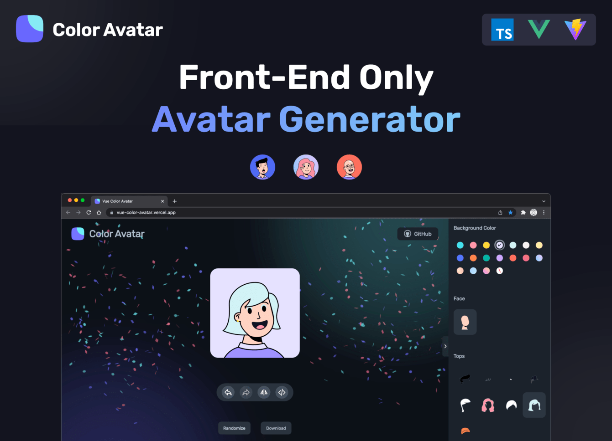

<div align="center">
  <h1>Avatar Generator</h1>

  <h2>✨ 一个简单的头像在线生成网站 ✨</h2>

[Read in English](./README.md)

</div>

<a href="#">
  
</a>

## 介绍

**Avatar Generator是一个基于浏览器的头像生成工具，用户可以通过可视化组件选择和配置来创建矢量风格的头像。**

本项目的核心功能包括头像定制、使用特殊头像变体随机生成、批处理功能和多格式导出选项。

该系统支持国际化，包括撤消/重做作的全面状态管理。

这个项目提供了一个完整的前端解决方案，没有后端依赖，使其适合作为静态 Web 应用程序进行部署。

## 功能

**定制头像**
头像定制系统以组件为中心，它提供了一个可滚动的侧边栏界面，用于修改头像属性。用户可以通过专用部分自定义包装形状、背景颜色、边框颜色和个人面部特征。

该界面使用钩子进行状态管理，并在用户进行更改时提供即时视觉反馈。

**随机生成头像**
随机生成系统通过智能选择小部件形状、颜色和配置，同时避免视觉冲突，创建多样化、美观的头像。

它是围绕几个关键实用函数构建的，这些函数处理头像随机化的不同方面。主要入口点是协调生成完整的随机头像配置。

该系统能够防止头像元素之间的视觉冲突的逻辑，特别是特定发型的头发颜色和背景颜色之间的视觉冲突。

**头像导出**
头像导出系统提供了下载生成的 PNG 格式头像的功能，支持单个头像下载和批量下载打包在 ZIP 存档中的多个头像。

导出系统会自动检测浏览器兼容性并相应地调整下载方法。对于不兼容的浏览器，它会以模式显示图像，而不是触发直接下载。

## 项目开发

Vue Color Avatar 建立在以 `Vue3` 和 `Vite` 为中心的现代前端技术之上。

该应用程序利用 `TypeScript` 实现类型安全，并使用基于组件的架构。

本项目使用 Pinia 进行响应式状态管理，使用 vue-i18n 进行跨英文和中文的国际化支持。

### 快速运行

```sh
# 1.克隆项目至本地
git clone https://github.com/75013c/avatar-generator.git

# 2.安装项目依赖
npm install

# 3.运行项目
npm run dev
```

### Docker 快速部署

```sh
# 1.克隆项目至本地
git clone https://github.com/75013c/avatar-generator.git

# 2.docker 编译
cd vue-color-avatar/
docker build -t vue-color-avatar:latest .

# 3.启动服务器
docker run -d -p 3000:80 --name vue-color-avatar vue-color-avatar:latest
```

容器运行后，打开浏览器并访问：

- http://localhost:3000 (本地运行)
- http://your-server-ip:3000 (在服务器上运行)

## 设计资源

- 设计师：[@Micah](https://www.figma.com/@Micah) on Figma
- 素材来源：[Avatar Illustration System](https://www.figma.com/community/file/829741575478342595)

## 联系我们

如果你在使用和开发过程中遇到了任何问题，或想要提出建议，请联系我们。

电子邮箱:756476@qq.com

QQ:565688

Twitter:@dbdjs
