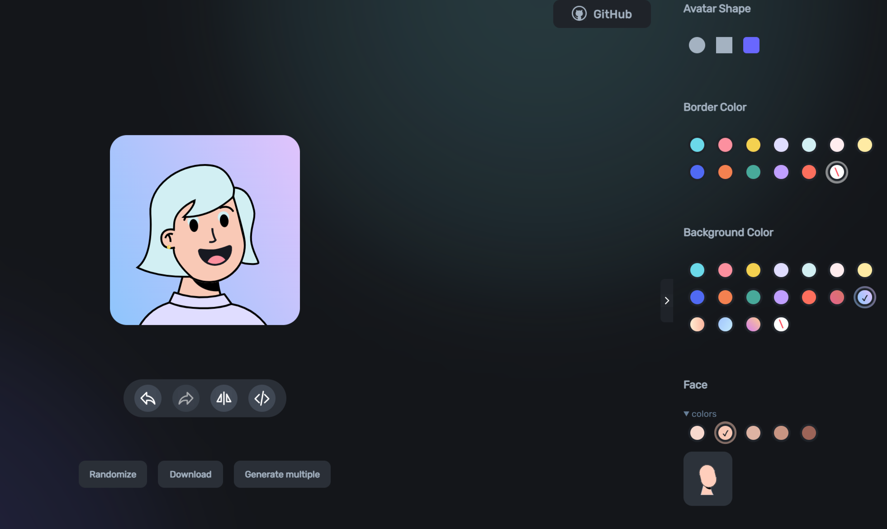
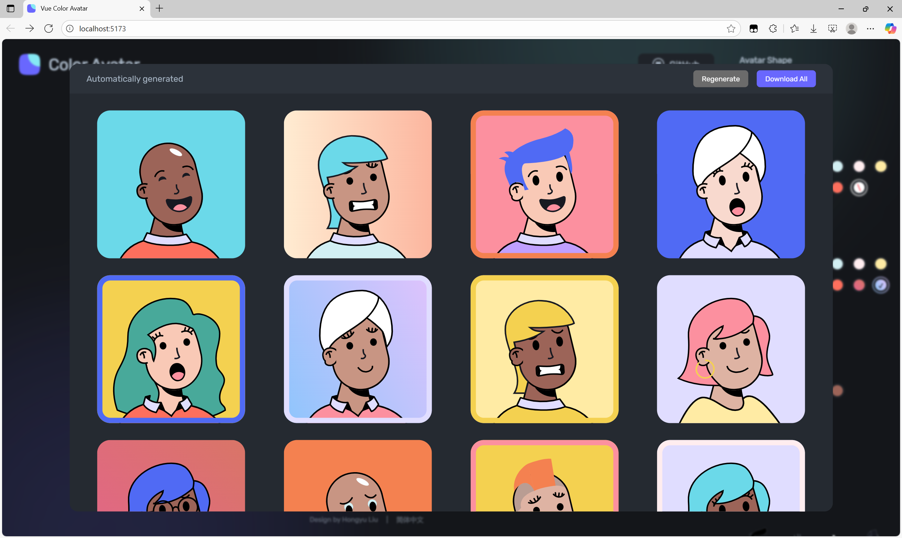

<div align="center">
  <h1>Avatar Generator</h1>

  <h2>✨ A user-friendly online avatar generator ✨</h2>

[用中文显示](./README-CN.md)

</div>

<a href="#">
  
</a>

## Introduction

**Avatar Generator is a browser-based avatar generation tool that enables users to create vector-style avatars through visual component selection and configuration.**

Core functionality encompasses avatar customization, random generation with special avatar variants, batch processing capabilities, and multi-format export options. 

The system supports internationalization and includes comprehensive state management for undo/redo operations.

This project provides a complete frontend solution with no backend dependencies, making it suitable for deployment as a static web application.

## Function

### Avatar Customization



The avatar customization system is centered around the component, which provides a scrollable sidebar interface for modifying avatar properties. Users can customize wrapper shapes, background colors, border colors, and individual facial features through dedicated sections.

The interface uses the hook for state management and provides immediate visual feedback when users make changes.

### Random Generation



The random generation system creates diverse, aesthetically pleasing avatars by intelligently selecting widget shapes, colors, and configurations while avoiding visual conflicts.

It is built around several key utility functions that handle different aspects of avatar randomization. The main entry point is which orchestrates the generation of a complete random avatar configuration.

The system includes logic to prevent visual conflicts between avatar elements, particularly between hair colors and background colors for specific hairstyles:

### Avatar Export

The Avatar Export system provides functionality for downloading generated avatars in PNG format, supporting both single avatar downloads and batch downloads of multiple avatars packaged in ZIP archives. 

The export system automatically detects browser compatibility and adjusts the download method accordingly. For incompatible browsers, it displays the image in a modal instead of triggering a direct download.

## Project Development

The Avatar Generator is built on modern frontend technologies centered around `Vue3` and `Vite`. 

The application leverages `TypeScript` for type safety and uses a component-based architecture.

It uses Pinia for reactive state management and vue-i18n for internationalization support across English and Chinese languages.

### Fast running

```sh
# 1.Clone project to local environment
git clone https://github.com/75013c/avatar-generator.git

# 2.Install dependencies
npm install

# 3.Run project
npm run dev
```

### Docker deployment

```sh
# 1.Clone project to local environment
git clone https://github.com/75013c/avatar-generator.git

# 2.Docker build
cd vue-color-avatar/
docker build -t vue-color-avatar:latest .

# 3.Start server
docker run -d -p 3000:80 --name vue-color-avatar vue-color-avatar:latest
```

Once the container is running, open your browser and visit:

- http://localhost:3000 (if running locally)
- http://your-server-ip:3000 (if running on a server)

## Assets

- Art designer：[@Micah](https://www.figma.com/@Micah) on Figma
- Source material：[Avatar Illustration System](https://www.figma.com/community/file/829741575478342595)

## Contact us

If you encounter any issues during use and development, or have suggestions to offer, please contact us.

Email:756476@qq.com

QQ:565688

Twitter:@dbdjs
